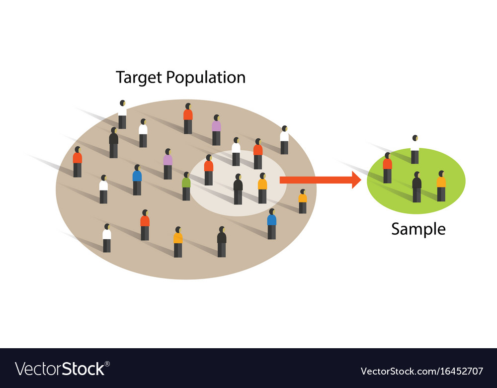

# Introducation to Stats for the Data Scince 


## What is Stats ? 
``` Stats is the scince of better orgnising and analysing the data.  ```

## Why we are using the stats ?
```For the better duscion making . ``` 

Now, we know that the what is stats and why is used.<br> 
But it has two different Types such as.
- **Discreptive { Organising, Summarizing}**
- **Infrancial {Conclusion on the data we have }**

## What is data ?
It is fact of informetion that can be measured . it can be any. 

``` 
age = { 1,2,3,4,5,6,6,7,8 } 
age is variable .
and inside the curly braces is the data.
``` 
## What is variable ?
A variable is the contanier which can holds the data .<br>
Or we can say variable is property which can take any property.

Now we will deeply look inside the Discreptive stats.<br>
Inside this we want to know about the more folowing.

1. **Populetion (N)** 
2. **Samples (n)**

 


There are so many ways for taking the samples. 
- Random . 
- Stratified / Layered / Strata .
- Systmatic . 
- Conviniant .  
